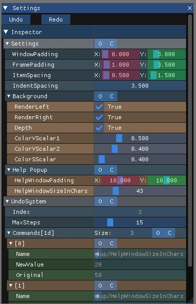

# xProperties (Version: 0.3 Pre-Alpha)

[             ](https://gitlab.com/LIONant/properties/issues)
[](https://gitlab.com/LIONant/properties)
[              ](https://opensource.org/licenses/MIT)
<br>
[            ](https://gitlab.com/LIONant/properties/blob/master/docs/Documentation.md)
[            ]()
<br>
[          ]()
[            ]()
[   ](https://github.com/LIONant-depot/xproperty/blob/master/documentation/Documentation.md)
<br>
<br>


Simple yet powerful reflection system / property system. This project is meant for students and professionals alike to have 
a default goto code that solves the very annoying issue of C++ properties. The code should be able to be inserted in game engines 
and applications without a problem. If you wish please read the
[Documentation](https://github.com/LIONant-depot/xproperty/blob/master/documentation/Documentation.md). 

Any feedback is welcome. Please follow us and help support the project.

# Code example:

```cpp
struct common
{
    int       m_ValueHoldingVar     = 0;
    const int m_ReadOnlyValue       = 100;  

    void setValues() {/*...*/}

    XPROPERTY_DEF
    ( "Common", common
    , obj_member<"m_ValueHoldingVar", &common::m_ValueHoldingVar>
    , obj_member<"m_ReadOnlyValue",   &common::m_ReadOnlyValue >
    , obj_member<"setValues",         &common::setValues>
    )
};
XPROPERTY_REG(common)
```

# Features
* **MIT license**
* **C++20**
* **Single header**
* **No allocations**
* **No external dependencies**
* **No macros overused** (4 of them used for convinience)
* **No exceptions for maximun speed**
* **No extra/external compilation step needed** 
* **Minimalistic API**
* **Op-In properties**
* **Flexible configuration**
* **Data and Function base properties**
* **Allows the user to support any container such `std::array` and `std::vector` or anything else**
* **Support C-arrays, raw pointers, and the user can add support for std::share_ptr or any other C++ type of pointer**
* **Very easy to extend (Easy to add new types, and add extra data per type, or new type of lists)**
* **Supports base class interface for OOP**
* **Handle any kind of inheritance**
* **Works on all major compilers**
* **Examples for all the features and [Documentation](https://github.com/LIONant-depot/xproperty/blob/master/documentation/Documentation.md)**
* **Property Inspector Example for [ImGui](https://github.com/ocornut/imgui) with *undo/redo***



# TODO:
* **Add support for `std::variant`**
* **Add support for unions**
* **Compound properties**
