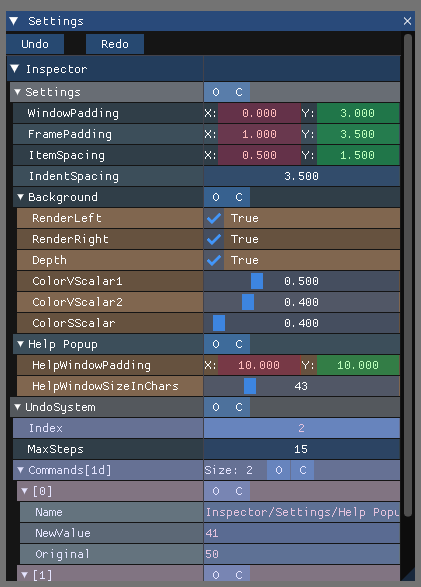

# The xProperty ImGui Inspector — A Student's Guide



This guide walks through `xproperty::inspector`, the ImGui-based property grid that ships with
xProperty (`source/examples/imgui/`). It assumes you already know how to declare a reflected class
with `XPROPERTY_DEF`/`XPROPERTY_REG` — see [Simple Example 01](SimpleExample01.md) if you don't yet.

Like Odin Inspector for Unity, most of what you'll do here is attach a **tag** to a member declaration
and let the framework do the rest — no hand-written ImGui code needed for the common cases. This guide
goes example-first; each one is short, complete, and runnable on its own.

## Show an object in a window

```cpp
struct player
{
    std::string m_Name  = "Hero";
    int         m_Level = 1;
    float       m_Speed = 5.5f;

    XPROPERTY_DEF
    ( "Player", player
    , obj_member<"Name",  &player::m_Name>
    , obj_member<"Level", &player::m_Level>
    , obj_member<"Speed", &player::m_Speed>
    )
};
XPROPERTY_REG(player)

void DrawMyWindow()
{
    static player               MyPlayer;
    static xproperty::inspector MyInspector{ "Player Inspector" };
    static bool                 Init = false;

    if (Init == false)
    {
        Init = true;
        MyInspector.clear();
        MyInspector.AppendEntity();
        MyInspector.AppendEntityComponent(*xproperty::getObject(MyPlayer), &MyPlayer);
    }

    xproperty::settings::context Context;
    MyInspector.Show(Context, []{}); // extra buttons for this window go in this lambda - see "Undo/Redo" below
}
```

Call `DrawMyWindow()` once per frame. `static` + the `Init` flag mean setup happens once, not every
frame. That's the whole recipe - a live-editable window, zero hand-written ImGui code.

## Style a field

```cpp
, obj_member<"Level", &player::m_Level
    , member_ui<int>::scroll_bar<1, 99>                // slider, 1-99, instead of the default drag box
    , member_help<"The player's current level (1-99)">>
, obj_member<"Speed", &player::m_Speed
    , member_flags<xproperty::flags::SHOW_READONLY>>   // visible, not editable
, obj_member<"Debug Notes", &player::m_Notes
    , member_flags<xproperty::flags::DONT_SHOW>>       // hidden, still saved
```

| Tag | Effect |
|---|---|
| `member_ui<T>::style<...>` | pick a different built-in widget / set its range, speed, format |
| `member_help<"...">` | tooltip |
| `member_flags<SHOW_READONLY \| DONT_SHOW \| DONT_SAVE \| APPEND_NEW_LINE>` | visibility/save flags |
| `member_dynamic_flags<+[](const T& O){ ... }>` | same flags, computed from the object's own state |
| `member_section<"Group Name">` | a separator line before a run of related fields |
| `member_item_width<-28.0f>` | narrow the value widget to leave room for something appended next to it |

## Arrays - mostly automatic

```cpp
struct inventory
{
    std::vector<std::string> m_Items = { "Sword", "Shield" };

    XPROPERTY_DEF( "Inventory", inventory
    , obj_member<"Items", &inventory::m_Items, member_help<"Drag to reorder">>
    )
};
```

That's it - drag-to-reorder and insert/delete controls come for free, for both scalar arrays
(`std::vector<std::string>` above) and object arrays (`std::vector<SomeReflectedStruct>`). A fixed
`std::array<T,N>` shows the same controls but read-only, unless you give it a real backing count via
`member_overwrite_list_size` - see `array_ops_smoke_test` in
`source/Examples/E04_Properties/E04_Properties.cpp` for a worked example.

## Undo/Redo, for free, on ordinary fields

Every plain field edited through the grid already fires `inspector::m_OnChangeEvent` when you finish
editing it. Wire that to an undo system once, and get a full undo/redo stack with no other code:

```cpp
static xproperty::ui::undo::system MyUndo;

MyInspector.m_OnChangeEvent.Register< [&](xproperty::inspector&, const xproperty::ui::undo::cmd& Cmd)
{
    MyUndo.Add(Cmd);
}>();

// in Show()'s callback:
MyInspector.Show(Context, [&]
{
    if (ImGui::Button("Undo")) MyUndo.Undo(Context);
    ImGui::SameLine();
    if (ImGui::Button("Redo")) MyUndo.Redo(Context);
});
```

Everything from here on plugs into this same undo system.

## Custom rendering - a property draws itself

Four tags, each attached directly to the `obj_member<>` declaration, same as `member_help` above.
**The property declares its own behavior where it's declared** - nothing else in your code needs to
know this property exists or match it by name.

**Append something after the normal widget:**

```cpp
, obj_member<"Seed", &generator::m_Seed
    , member_item_width<-28.0f>
    , member_custom_render_append<+[](xproperty::inspector& Insp, const xproperty::type::object& Obj, void* pInstance, std::string_view Path, const xproperty::any& Value) noexcept
        {
            ImGui::SameLine();
            if (ImGui::Button("Randomize"))
            {
                xproperty::any NewValue; NewValue.set<int>(Value.get<int>() * 1103515245 + 12345);
                std::string Error; xproperty::settings::context Context;
                Insp.BeginEdit(Obj, pInstance, "Randomize Seed"); // see "Multi-field edits" below
                xproperty::sprop::setProperty(Error, pInstance, Obj, xproperty::sprop::container::prop{ std::string(Path), NewValue }, Context);
                Insp.CommitEdit(Context);
            }
        }>>
```

**Replace the value widget, or the whole row** (`member_custom_render_replace_value` /
`member_custom_render_replace_row` - use one or both on the same property):

```cpp
, obj_member<"Dice Roll", &game::m_Roll
    , member_custom_render_replace_row<+[](xproperty::inspector&, const xproperty::type::object&, void*, std::string_view, const xproperty::any&, bool& bHandled) noexcept
        { bHandled = true; ImGui::TextColored(ImVec4(0.2f,0.9f,0.9f,1), "Dice"); }>
    , member_custom_render_replace_value<+[](xproperty::inspector& Insp, const xproperty::type::object& Obj, void* pInstance, std::string_view Path, const xproperty::any& Value, bool& bHandled) noexcept
        {
            bHandled = true;
            if (ImGui::Button(std::format("Roll (currently {})", Value.get<int>()).c_str(), ImVec2(-1,0)))
            {
                xproperty::any NewValue; NewValue.set<int>((Value.get<int>() % 6) + 1);
                std::string Error; xproperty::settings::context Context;
                Insp.BeginEdit(Obj, pInstance, "Roll Dice");
                xproperty::sprop::setProperty(Error, pInstance, Obj, xproperty::sprop::container::prop{ std::string(Path), NewValue }, Context);
                Insp.CommitEdit(Context);
            }
        }>>
```

**Show an "overridden from base value, click to revert" indicator:** `member_override_check` (decide
if the current value differs from your notion of a base) + `member_override_reset` (write the base
value back) - same shape as the tags above.

> **Prefer the tag over the broadcast delegate.** Every tag here has an inspector-wide twin
> (`m_OnCustomRenderAppend`, `m_OnOverrideCheck`, etc.) you register once and which fires for *every*
> property, checking `Path` itself to decide relevance. That's still the right tool for a genuinely
> shared, inspector-wide default - but reaching for it to handle one named property means your generic
> wiring code has to know that property exists. The knowledge belongs on the declaration.

## Escape the grid entirely - `member_custom_render_block`

For a graph, a curve editor, anything that needs the full window width. Fires twice per property: an
*ask* pass (`bDryRun = true`, decide only) and a *draw* pass:

```cpp
, obj_member<"Graph", &recorder::m_Samples
    , member_custom_render_block<+[](xproperty::inspector&, const xproperty::type::object&, void* pInstance, std::string_view, const xproperty::any&, std::uint32_t, bool bDryRun, bool& bIsBlockContent) noexcept
        {
            bIsBlockContent = true;
            if (bDryRun) return;
            auto& Samples = static_cast<recorder*>(pInstance)->m_Samples;
            ImGui::PlotLines("##Graph", Samples.data(), (int)Samples.size(), 0, nullptr, 0.0f, 1.0f, ImVec2(-1, 80));
        }>>
```

If the block property is a `std::vector<SomeStruct>` (a real curve made of keyframes, say), one tag on
the array is enough - the framework remembers "this array just claimed block content" and treats every
element and its own fields as silently part of the same block, so they never fall through and render
as a second, redundant array section underneath your drawing.

## Multi-field edits, and edits to fields with no row of their own

A block callback has the real `pInstance` pointer, so it's free to write to *any* field directly - not
just the one the tag is attached to (a curve's tangent handle, say, which has no row of its own at
all). Bracket that with `BeginEdit`/`CommitEdit`:

```cpp
Insp.BeginEdit(Obj, pInstance, "Move Point");   // snapshots the WHOLE owning object now
// ... write to as many fields as you want, across as many frames as a drag takes ...
Insp.CommitEdit(Context);                        // re-snapshots; if anything changed, ONE undo step
```

- `CommitEdit` is a no-op if nothing actually changed since `BeginEdit` - so calling `BeginEdit` once
  when a drag starts and `CommitEdit` once when it ends gives you exactly **one** undo step for the
  whole drag, however many frames it spanned.
- Plugs into the same `xproperty::ui::undo::system` from the "Undo/Redo" section above - nothing
  extra to wire up.

See `DrawCurveEditor` in `source/Examples/E04_Properties/E04_Properties.cpp` for a complete example
combining a custom block, a reflected array of a custom struct, live dragging, insert/delete, and
full undo/redo.

## Reusing a tag across declaration sites

Tags aren't inherited by name - only by being physically attached. If the same field appears twice
(a debug panel showing the same struct nested one level deeper, say), pull the lambda into a named
function and reference it from both `obj_member<>` sites:

```cpp
static void DrawRollButton(xproperty::inspector& Insp, const xproperty::type::object& Obj, void* pInstance, std::string_view Path, const xproperty::any& Value, bool& bHandled) noexcept
{ bHandled = true; /* ... */ }

, obj_member<"Dice Roll", &game::m_Roll,       member_custom_render_replace_value<DrawRollButton>>
, obj_member<"Dice Roll", &game::m_NestedRoll, member_custom_render_replace_value<DrawRollButton>>
```

## Advanced: every field of one C++ type, everywhere

Everything above customizes one *property*. A separate mechanism customizes every field of a given
type automatically, with no per-property tag at all - it's how `xresource::full_guid` gets a
resource-picker widget on any field of that type, in any struct. It means adding a real drawer
function to the library's own `.cpp`, not just tagging a declaration - see
`draw<xresource::full_guid, style::defaulted>::Render` in `xPropertyImGuiInspector.cpp` and its
registration in `register_all_draw_fns`. Reach for this only when you want "every field of this type,"
not "this one field."

## Quick reference

| I want to... | Use |
|---|---|
| Change a widget's style/range | `member_ui<T>::style<...>` |
| Add a tooltip | `member_help<"...">` |
| Hide / read-only / skip saving | `member_flags<...>` / `member_dynamic_flags<...>` |
| Group fields with a separator | `member_section<"...">` |
| Draw something after a field | `member_custom_render_append` |
| Replace a field's value widget | `member_custom_render_replace_value` |
| Replace a field's whole row | `member_custom_render_replace_row` |
| "Overridden, click to revert" indicator | `member_override_check` / `member_override_reset` |
| Escape the 2-column grid (a graph, a curve editor) | `member_custom_render_block` |
| Make a multi-field or hidden-field edit undoable | `inspector::BeginEdit` / `CommitEdit` |
| Same look for every field of one C++ type | a `draw<T,Style>::Render` specialization (advanced) |
